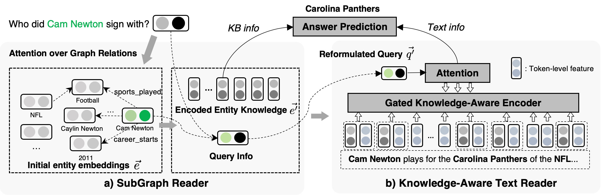

Code for the ACL 2019 paper:

## Improving Question Answering over Incomplete KBs with Knowledge-Aware Reader

Paper link: [https://arxiv.org/abs/1905.07098](https://arxiv.org/abs/1905.07098)

Model Overview:
<p align="center"></p>

### Requirements
* ``PyTorch 1.0.1``
* ``tensorboardX``
* ``tqdm``
* ``gluonnlp``

### Prepare data
```
mkdir datasets && cd datasets && wget https://sites.cs.ucsb.edu/~xwhan/datasets/webqsp.tar.gz && tar -xzvf webqsp.tar.gz && cd ..
```

### Full KB setting
```
CUDA_VISIBLE_DEVICES=0 python train.py --model_id KAReader_full_kb --max_num_neighbors 50 --label_smooth 0.1 --data_folder datasets/webqsp/full/ 
```

### Incomplete KB setting
Note: The Hits@1 should match or be slightly better than the number reported in the paper. More tuning on threshold should give you better F1 score. 
#### 30% KB
```
CUDA_VISIBLE_DEVICES=0 python train.py --model_id KAReader_kb_03 --max_num_neighbors 50 --use_doc --data_folder datasets/webqsp/kb_03/ --eps 0.05
```

#### 10% KB
```
CUDA_VISIBLE_DEVICES=0 python train.py --model_id KAReader_kb_01 --max_num_neighbors 50 --use_doc --data_folder datasets/webqsp/kb_01/ --eps 0.05
```
#### 50% KB
```
CUDA_VISIBLE_DEVICES=0 python train.py --model_id KAReader_kb_05 --num_layer 1 --max_num_neighbors 100 --use_doc --data_folder datasets/webqsp/kb_05/ --eps 0.12 --seed 3 --hidden_drop 0.05
```

### Citation
```
@article{xiong2019improving,
  title={Improving Question Answering over Incomplete KBs with Knowledge-Aware Reader},
  author={Xiong, Wenhan and Yu, Mo and Chang, Shiyu and Guo, Xiaoxiao and Wang, William Yang},
  journal={arXiv preprint arXiv:1905.07098},
  year={2019}
}
```
